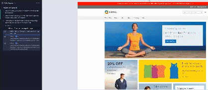

# jobsity_challenge
## Index

- [Introdution](#Introdution)
- [Automation Challenge](#Automation-Challenge)
- [Used technologies](#used-technologies)
- [Run test](#run-test)
- [Final Considerations](#final-considerations)
---
## Introdution 

The goal is to create a project showcasing my expertise in ensuring the quality and reliability of software applications using the Cypress framework.

>Key Features:
* UI Tests: The goal of this challenge is to successfully execute all the testing steps on the given websites, starting
from QA planning, all the way to reporting

>Benefits of automated:
* Efficient and Accurate Testing: By automating UI testing, I can conduct tests quickly and accurately, saving time and reducing the possibility of human error. This approach allows me to deliver reliable results consistently.
* Thorough Validation: The test suite provides comprehensive coverage, considering potential error scenarios. I have designed it to ensure that all critical aspects are validated, guaranteeing the application's reliability and performance.
* Enhanced Quality Assurance: The automated UI testing enables me to identify and rectify issues proactively, delivering an exceptional user experience.

By utilizing this advanced UI test suite, I demonstrate my dedication to ensuring the highest standards of quality and efficiency.

## Automation Challenge

> Remarks requested

The intention is not the quantity of coverage, but rather to use this opportunity to demonstrate knowledge and skills in quality, organization, workflow, attention to security, generation, and cleanup of test data (when possible), documentation, and development of best practices
* Use best practices;
* The test should be repeatable;

>1° part:

Create test cases for Magento: https://magento.softwaretestingboard.com/ :
- Deliver a detailed planning sheet for each exercise
- Design good test cases

`You can find here a brief test planning and test cases for Magento application` https://docs.google.com/spreadsheets/d/1bSyyvOCXRzCRj4h1tkuyimA6pQFw3CqfauAhYq_1cUs/edit?usp=sharing


>2° part:
Create 
- Find as many bugs as possible on each website.
- Keep track of the bug life cycle with your Trello board.
- Show evidence of the bugs. Let us know how critical they are.
- Deliver a test run report and a bug report for each website.

`You can find here all bugs that I found during the process` https://trello.com/b/jZWkkpJr/jobsity-challenge

>3° part:
 Create automation tests:

- Deliver a good automation suite.
- The project should be able to run on any computer.

I focused on order and payment to create the suite test, because I did not find the return order to be automated.

`Demonstration of the scenario applied in the UI automated test.`

```gherkin
# Author: Lucas Matheus de souza Pereira
# language: en
@cypress @javascript @magento
Feature: Register new accounts

  Background:
    Given I am on the magento page
    When I want to click in Create an Account
    And I want to create a new customer accounts

  @order @E2E
  Scenario: Check that user will be ableto to remove items from cart on the header.
    Given I want to seach for "Radiant Tee" product
    When I want to select some product characteristics
      | size | color | quantity |
      | M    | Blue  | 2        |
    And I click in add to Cart button
    Then I want to see how many items was add into cart "2"
    When I click in delete item icon
    Then The system will display a modal with this message "Are you sure you would like to remove this item from the shopping cart?"

  @order @E2E
  Scenario: Check that the product you select is the same as the one the cart stores (color, size,quantity)
    Given I want to seach for "Radiant Tee" product
    When I want to select some product characteristics
      | size | color | quantity |
      | M    | Blue  | 1        |
    And I click in add to Cart button
    Then the system will display this message "You added Radiant Tee to your shopping cart."
    And I want to see how many items was add into cart "1"
    When I click in See Details
    Then I want to see the same product characteristics that I choose
      | size | color | quantity | name        |
      | M    | Blue  | 1        | Radiant Tee |

  @payment @E2E
  Scenario: Users should be presented with a checkout form using Proceed to checkout link on the header cart
    Given I want to seach for "Radiant Tee" product
    When I want to select some product characteristics
      | size | color | quantity |
      | M    | Blue  | 1        |
    And I click in add to Cart button
    Then I want to see how many items was add into cart "1"
    When I click in Proceed to checkout button
    And I fill all shipping address information
    And I click in place order to confirm it
    Then The system will display thanks message for my purchase

```


## Used technologies 
---
For this challenge, The following technologies were used:
- Javascript
- Typescript
- Cucumber
- Cypress
- Node
---

## Run tests

To run the project, just go in your favorite terminal to the project directory and execute the following command:

This command installs a package and any packages that it depends on.
```bash
  $ npm install
```
This command is responsible for running the tests.
```bash
  $ npx cypress open
or
  $ npx cypress run
```
---
## Final Considerations
```
In summary, the challenge was funny, I was able to apply some techniques in the tests and try to make it as simple as possible. 
I hope I was able to show what was requested.

In this challenge, I created the automation script, I used the Cypress framework for several reasons, including its simplicity of configuration, self-sufficiency in validation capabilities without the need for additional frameworks, a shallow learning curve, and seamless cross-browser testing.
It's worth noting that I use the same programming language as the front end, which facilitates collaboration with the development team to enhance test coverage.
```
[Go To TOP](#TOP)


